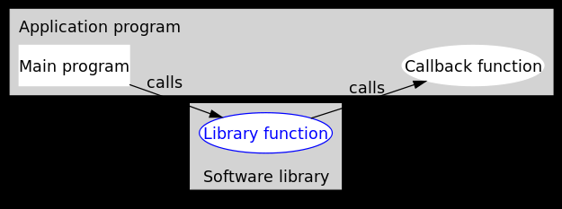

# 定义

参考[https://www.cnblogs.com/uestc-mm/p/15478432.html](https://www.cnblogs.com/uestc-mm/p/15478432.html)

    编程分为两类：系统编程（system programming）和应用编程（application programming）。所谓系统编程，简单来说，就是编写库；而应用编程就是利用写好的各种库来编写具某种功用的程序，也就是应用。系统程序员会给自己写的库留下一些接口，即API（application programming interface，应用编程接口），以供应用程序员使用。所以在抽象层的图示里，库位于应用的底下。
     当程序跑起来时，一般情况下，应用程序（application program）会时常通过API调用库里所预先备好的函数。但是有些库函数（library function）却要求应用先传给它一个函数，好在合适的时候调用，以完成目标任务。这个被传入的、后又被调用的函数就称为回调函数（callback function）。



    可以看到，回调函数通常和应用处于同一抽象层（因为传入什么样的回调函数是在应用级别决定的）。而回调就成了一个高层调用底层，底层再回过头来调用高层的过程。（我认为）这应该是回调最早的应用之处，也是其得名如此的原因。

# 优势

    回调机制的优势从上面的例子可以看出，回调机制提供了非常大的灵活性。请注意，从现在开始，我们把图中的库函数改称为中间函数了，这是因为回调并不仅仅用在应用和库之间。任何时候，只要想获得类似于上面情况的灵活性，都可以利用回调。
	这种灵活性是怎么实现的呢？乍看起来，回调似乎只是函数间的调用，但仔细一琢磨，可以发现两者之间的一个关键的不同：在回调中，我们利用某种方式，把回调函数像参数一样传入中间函数。可以这么理解，在传入一个回调函数之前，中间函数是不完整的。换句话说，**程序可以在运行时，通过登记不同的回调函数，来决定、改变中间函数的行为。这就比简单的函数调用要灵活太多了。**


# 简单的回调


***test.c***

```C
#include <stdio.h>

int Callback_1() // Callback Function 1
{
    printf("Hello, this is Callback_1 \n");
    return 0;
}

int Callback_2() // Callback Function 2
{
    printf("Hello, this is Callback_2 \n");
    return 0;
}

int Handle(int (*Callback)()) // 函数的参数为回调函数的基本形式 int (*Callback)()
{
    printf("Entering Handle Function. ");
    Callback();
    printf("Leaving Handle Function. ");
}

int main(void)
{
    Handle(Callback_2); // 注册回调函数, 并调用
    return 0;
}
```

***Userguide***

```bash
gcc -o test test.c
./test
```


# 完整的回调

***CallBackTestBench.c***

<details open=""><summary><font color="#c7254e" size="4px">view code</font></summary>

```markdown
  

#include "CallBackTestBench.h"

#define DEBUG 1

/**********************************************************************
* 函数名称： // int CallBackRegister(ST_ParamTrans *Obj, int index, int queue_id, pf_callbakck callbackfunc, void *CallBackFuncParam)

* 功能描述： // 注册回调函数, 将回调函数入口地址传入, 传入注册回调函数参数, 传入回调函数参数, 共同更新ST_ParamTrans注册回调函数结构体
* 访问的表： //
* 修改的表： //
* 输入参数： // ST_ParamTrans *Obj 注册回调函数结构体
* 输入参数： // int index, int queue_id 注册回调函数结构体
* 输入参数： // pf_callbakck callbackfunc 回调函数入口地址传入
* 输入参数： // void *CallBackFuncParam 回调函数参数地址传入

* 输出参数： // 对输出参数的说明
* 返 回 值： // int: 0 执行成功 -1 执行失败
* 其它说明： // 其它说明
* 修改日期       修改人	     修改内容
* -----------------------------------------------
* 2021/11/02	  	    XXXX	      XXXX
***********************************************************************/
int CallBackRegister(ST_ParamTrans *Obj, int index, int queue_id, pf_callbakck callbackfunc, void *CallBackFuncParam)
{
    ST_ParamTrans* ThreadParams = (ST_ParamTrans* )Obj;
    if(NULL == callbackfunc)
    {
#if DEBUG
        printf("Error callback func register:%s-%d\n", __FUNCTION__,__LINE__);
#endif
        return -1;
    }
    if((NULL == ThreadParams->g_ptrfun) && (0x00 == (ThreadParams->CallbackStatus & 0x01))){
        ThreadParams->index = index;
        ThreadParams->params = queue_id;
        ThreadParams->func_param = CallBackFuncParam;
        ThreadParams->g_ptrfun = callbackfunc;
        ThreadParams->CallbackStatus |= 0x01;
#if DEBUG
        printf("Success Callback func Register:%s-%d\n", __FUNCTION__,__LINE__);
#endif
        return 0;
    }else{
#if DEBUG
        printf("Callback func already Registered(Running):%s-%d\n", __FUNCTION__,__LINE__);
#endif
        return -1;
    }
}

/**********************************************************************
* 函数名称： // static void *CallBackDestroy(void *arg)

* 功能描述： // 回调函数取消注销的阻塞等待函数, 确保取消注销函数的正确执行而不影响其立即返回
* 访问的表： //
* 修改的表： //
* 输入参数： // ST_ParamTrans *Obj: 回调函数所有参数结构体

* 输出参数： // 对输出参数的说明
* 返 回 值： // 
* 其它说明： // 其它说明
* 修改日期       修改人	     修改内容
* -----------------------------------------------
* 2021/11/02	  	    XXXX	      XXXX
***********************************************************************/
static void *CallBackDestroy(void *arg)
{
    ST_ParamTrans* ThreadParams = (ST_ParamTrans* )arg;
#if DEBUG
    printf("CallBackEventTrigger Status:%d:%s-%d\n", ThreadParams->CallbackStatus, __FUNCTION__,__LINE__);
#endif
    ThreadParams->g_ptrfun = NULL;
    while((0x02 == (ThreadParams->CallbackStatus & 0x02)));
#if DEBUG
    printf("CallBackEventTrigger Status:%d:%s-%d\n", ThreadParams->CallbackStatus, __FUNCTION__,__LINE__);
#endif
    ThreadParams->func_param = NULL;
    ThreadParams->CallbackStatus &= 0xFE;
#if DEBUG
    printf("Success:Callback func Unregister:%s-%d\n", __FUNCTION__,__LINE__);
#endif
    return NULL;
}

/**********************************************************************
* 函数名称： // int CallBackUnRegister(ST_ParamTrans *Obj)

* 功能描述： // 取消注册回调函数, 为下一次注册新的回调函数做准备
* 访问的表： //
* 修改的表： //
* 输入参数： // ST_ParamTrans *Obj: 回调函数所有参数结构体

* 输出参数： // 对输出参数的说明
* 返 回 值： // int: 0成功 -1失败
* 其它说明： // 其它说明
* 修改日期       修改人	     修改内容
* -----------------------------------------------
* 2021/11/02	  	    XXXX	      XXXX
***********************************************************************/
int CallBackUnRegister(ST_ParamTrans *Obj)
{
    char flag = 0;
    pthread_t th1;
    ST_ParamTrans* ThreadParams = (ST_ParamTrans* )Obj;
  
    if((NULL != ThreadParams->g_ptrfun) || (0x01 == (ThreadParams->CallbackStatus & 0x01))){
        flag = pthread_create(&th1,NULL,CallBackDestroy,ThreadParams); // Create the Thread1 & Start the thread func1.
        if(0 == flag){
#if DEBUG
            printf("Success:Callback func Unregister:%s-%d\n", __FUNCTION__,__LINE__);
#endif
            return 0;
        }else{
#if DEBUG
            printf("Error:pthread_create func failed:%s-%d\n", __FUNCTION__,__LINE__);
#endif
            return -1;
        }
    }else{
#if DEBUG
        printf("Error:Callback func is already Unregistered:%s-%d\n", __FUNCTION__,__LINE__);
#endif
        return -1;
    }
}

/**********************************************************************
* 函数名称： // static void CallBackEventTrigger(void *data, void *FuncParam, pf_callbakck g_ptrfun, char *CallbackStatus)

* 功能描述： // 将回调线程中的数据+回调函数参数 传入回调函数, 同时维护回调函数的执行状态(执行状态下不能随意取消注销回调函数)
* 访问的表： //
* 修改的表： //
* 输入参数： // void *data: T_Func_Data数据结构体地址
* 输入参数： // void *FuncParam: T_Func_Param参数结构体地址
* 输入参数： // pf_callbakck g_ptrfun: 回调函数入口地址
* 输入参数： // char *CallbackStatus: 回调函数状态维护地址

* 输出参数： // 对输出参数的说明
* 返 回 值： // 
* 其它说明： // 其它说明
* 修改日期       修改人	     修改内容
* -----------------------------------------------
* 2021/11/02	  	    XXXX	      XXXX
***********************************************************************/
static void CallBackEventTrigger(void *data, void *FuncParam, pf_callbakck g_ptrfun, char *CallbackStatus)
{
    if(NULL == g_ptrfun || NULL == data || NULL == FuncParam){ // 判断参数的可用性
#if DEBUG
        printf("No callback fun register:%s-%d\n", __FUNCTION__,__LINE__);
#endif
    }else{
        *CallbackStatus |= 0x02;  // 修改回调函数状态为回调执行状态
        g_ptrfun(data, FuncParam);  // 回调函数执行调用
        *CallbackStatus &= 0xFD;  // 修改回调函数状态为回调停止状态
    }
}

/**********************************************************************
* 函数名称： // static void *CallBackThread(void *arg)

* 功能描述： // 申请ST_ParamTrans结构体地址空间并初始化, 启动CallBackThread线程
* 访问的表： //
* 修改的表： //
* 输入参数： // void *arg: ST_ParamTrans结构体地址

* 输出参数： // 对输出参数的说明
* 返 回 值： // static void *
* 其它说明： // 其它说明
* 修改日期       修改人	     修改内容
* -----------------------------------------------
* 2021/11/02	  	    XXXX	      XXXX
***********************************************************************/
static void *CallBackThread(void *arg)
{
    int n = 1;
    srand(time(NULL));//设置随机数种子
    ST_ParamTrans *ThreadParams = (ST_ParamTrans *)arg; // 强制转换void *arg参数为ST_ParamTrans结构体
    T_Func_Data *ThreadDatas = malloc(sizeof(T_Func_Data)); // 申请回调函数使用的数据地址空间, 待传入
    ThreadDatas->Length = 10; // 数据地址空间长度
    ThreadDatas->DataArray = (int *)malloc(sizeof(int)*ThreadDatas->Length); // 数据地址空间内存
    while(1)
    {
        for(n=0;nLength;n++){
            ThreadDatas->DataArray[n] = rand() % 10; // 产生随机数填入到数据地址空间
        }
#if DEBUG
        printf("putQueue[%d] with index=%d.\n", ThreadParams->params, ThreadParams->index);
#endif
        CallBackEventTrigger(ThreadDatas, ThreadParams->func_param, ThreadParams->g_ptrfun, &ThreadParams->CallbackStatus); // 回调时间定时触发, 调用注册的回调函数, 输入当前线程产生的执行参数
        sleep(1);
    }
    free(ThreadParams); // 退出回调函数回收地址空间
    free(ThreadDatas->DataArray); // 退出回调函数回收地址空间
    free(ThreadDatas); // 退出回调函数回收地址空间
    return NULL;
}

/**********************************************************************
* 函数名称： // void *CallBackTestBenchSetup(int *ipState)

* 功能描述： // 申请ST_ParamTrans结构体地址空间并初始化, 启动CallBackThread线程
* 访问的表： //
* 修改的表： //
* 输入参数： // int *ipState CallBackTestBenchSetup函数执行结果 0成功 -1失败

* 输出参数： // 对输出参数的说明
* 返 回 值： // void *: ST_ParamTrans结构体地址
* 其它说明： // 其它说明
* 修改日期       修改人	     修改内容
* -----------------------------------------------
* 2021/11/02	  	    XXXX	      XXXX
***********************************************************************/
void *CallBackTestBenchSetup(int *ipState)
{
    pthread_t th1;
    ST_ParamTrans *ThreadParams = malloc(sizeof(ST_ParamTrans)); // 申请ST_ParamTrans结构体地址空间
    if(NULL == ThreadParams){
        printf("Initial DataCalculate Failed:%s-%d\n", __FUNCTION__,__LINE__);
        *ipState = -1;
        return NULL;
    }else{
        *ipState = 0;
        memset(ThreadParams, 0, sizeof(ThreadParams)); // ST_ParamTrans结构体必须初始化为0
#if DEBUG
        printf("Initial DataCalculate params:%s-%d\n", __FUNCTION__,__LINE__);
#endif
        pthread_create(&th1,NULL,CallBackThread,ThreadParams); // Create the Thread1 & Start the thread CallBackThread.
        return ThreadParams;
    }
}
折叠 
```

</details>

***CallBackTestBench.h***

<details open=""><summary><font color="#c7254e" size="4px">view code</font></summary>

```markdown


#ifndef _DATA_CALCULATE_H_
#define _DATA_CALCULATE_H_
#include 
#include 
#include 
#include 
#include 
#include 
#include 
#include 
#include 
#include  

typedef void(*pf_callbakck)(void *data, void *param); // 回调函数指针接口形式

typedef struct T_Func_Param{ // 回调函数参数结构体内容
    int a; // 参数1
    int b; // 参数2
    int c; // 参数3
}T_Func_Param;

typedef struct T_Func_Data{ // 回调函数数据结构体内容
    int Length; // 数据总长度
    int *DataArray; // 数据存储空间指针
}T_Func_Data;

typedef struct ParamTrans_ST{ // 注册回调函数数据结构体内容
	int index; // 注册回调函数及注册回调线程基本参数1
	int params; // 注册回调函数及注册回调线程基本参数2
	void *func_param; // 回调函数基本参数
    pf_callbakck g_ptrfun; // 回调函数入口地址
    char CallbackStatus; // 注册回调函数及注册回调线程基本状态记录
}ST_ParamTrans;

/**********************************************************************
* 函数名称： // int CallBackRegister(ST_ParamTrans *Obj, int index, int queue_id, pf_callbakck callbackfunc, void *CallBackFuncParam)

* 功能描述： // 注册回调函数, 将回调函数入口地址传入, 传入注册回调函数参数, 传入回调函数参数, 共同更新ST_ParamTrans注册回调函数结构体
* 访问的表： //
* 修改的表： //
* 输入参数： // ST_ParamTrans *Obj 注册回调函数结构体
* 输入参数： // int index, int queue_id 注册回调函数结构体
* 输入参数： // pf_callbakck callbackfunc 回调函数入口地址传入
* 输入参数： // void *CallBackFuncParam 回调函数参数地址传入

* 输出参数： // 对输出参数的说明
* 返 回 值： // int: 0 执行成功 -1 执行失败
* 其它说明： // 其它说明
* 修改日期       修改人	     修改内容
* -----------------------------------------------
* 2021/11/02	  	    XXXX	      XXXX
***********************************************************************/
int CallBackRegister(ST_ParamTrans *Obj, int index, int queue_id, pf_callbakck callbackfunc, void *CallBackFuncParam);

/**********************************************************************
* 函数名称： // void *CallBackTestBenchSetup(int *ipState)

* 功能描述： // 申请ST_ParamTrans结构体地址空间并初始化, 启动CallBackThread线程
* 访问的表： //
* 修改的表： //
* 输入参数： // int *ipState CallBackTestBenchSetup函数执行结果 0成功 -1失败

* 输出参数： // 对输出参数的说明
* 返 回 值： // void *: ST_ParamTrans结构体地址
* 其它说明： // 其它说明
* 修改日期       修改人	     修改内容
* -----------------------------------------------
* 2021/11/02	  	    XXXX	      XXXX
***********************************************************************/
void *CallBackTestBenchSetup(int *ipState);

/**********************************************************************
* 函数名称： // int CallBackUnRegister(ST_ParamTrans *Obj)

* 功能描述： // 取消注册回调函数, 为下一次注册新的回调函数做准备
* 访问的表： //
* 修改的表： //
* 输入参数： // ST_ParamTrans *Obj: 回调函数所有参数结构体

* 输出参数： // 对输出参数的说明
* 返 回 值： // int: 0成功 -1失败
* 其它说明： // 其它说明
* 修改日期       修改人	     修改内容
* -----------------------------------------------
* 2021/11/02	  	    XXXX	      XXXX
***********************************************************************/
int CallBackUnRegister(ST_ParamTrans *Obj);

#endif

折叠 
```

</details>

***main.c***

<details open=""><summary><font color="#c7254e" size="4px">view code</font></summary>

```cpp


#include 
#include 
#include 
#include 
#include 
#include 
#include  

#include "CallBackTestBench.h" // 注册回调函数接口以及启动等接口

void Test_CallBack_Func(void *data, void *param); // 需要等待注册的回调函数

int main(void)
{
    int flag = 0;
    char Key = 0;
    T_Func_Param func_param; // 回调函数Test_CallBack_Func的param参数
    void *DataCalculateObj = NULL; // 回调状态存储结构体ST_ParamTrans, 用来记录保存:注册回调线程参数+回调函数+回调函数参数+注册回调线程运行状态

    func_param.a = 303; // 回调函数Test_CallBack_Func的param参数初始化
    func_param.b = 202;
    func_param.c = 101;

    DataCalculateObj = CallBackTestBenchSetup(&flag); // 注册回调线程启动初始化, 启动回调线程, 初始化ST_ParamTrans结构体参数并返回
    if(flag < 0) // 检查CallBackTestBenchSetup执行状态, 成功返回0 失败返回-1
    {
        printf("Errro CallBackTestBenchSetup:%s-%d\n", __FUNCTION__,__LINE__);
        return 0;
    }

    flag = CallBackRegister(DataCalculateObj, 34, 8, Test_CallBack_Func, &func_param); // 注册回调函数, 将回调函数的入口地址传入执行, 同时传入注册回调线程参数以及回调函数参数
    if(flag < 0) // 检查CallBackRegister执行状态, 成功返回0 失败返回-1
    {
        printf("Errro CallBackFunc Register:%s-%d\n", __FUNCTION__,__LINE__);
    }

    while(1){
        Key = getchar();
        if(Key == 10) continue; // continue:避免重复输出getchar缓冲区中的内容
        printf("%x\n",Key);
        if('c' == Key){
            flag = CallBackUnRegister(DataCalculateObj); // 取消注册回调函数, 将会操作注销回调函数结构体ST_ParamTrans中的基本函数入口地址等
            if(flag < 0) // 检查CallBackUnRegister执行状态, 成功返回0 失败返回-1
            {
                printf("Errro CallBackFunc UnRegister:%s-%d\n", __FUNCTION__,__LINE__);
            }
        }else if('s' == Key){
            func_param.a = 10;
            func_param.b = 20;
            func_param.c = 30;
            flag = CallBackRegister(DataCalculateObj, 69, 2, Test_CallBack_Func, &func_param); // 重新注册回调函数, 将回调函数的入口地址传入执行, 同时传入注册回调线程参数以及回调函数参数
            if(flag < 0){
                printf("Errro CallBackFunc Register:%s-%d\n", __FUNCTION__,__LINE__);
            }
        }else if('q' == Key){
            printf("Thanks for using, Quit!\n");
            return 0;
        }
    }
    return 0;
}

void Test_CallBack_Func(void *data, void *param) // 回调函数
{
    int n = 0;
    int sum = 0;
    T_Func_Param *Params = (T_Func_Param *)param; // 强制转换回调函数参数param
    T_Func_Data *Datas = (T_Func_Data *)data; // 强制转换回调函数数据data
  
    printf("Params->a/b/c:%d/%d/%d\n",Params->a,Params->b,Params->c);

    for(n=0;nLength;n++){  // 回调函数中的主要工作即 对数据进行相乘求和操作
        sum += Datas->DataArray[n]*Params->a;
        printf("Datas are:%d, sum=%d\n",Datas->DataArray[n], sum);
    }

    printf("Datas sum:%d\n",sum); // 打印回调函数执行结果
}
折叠 
```

</details>

***Makefile***

```Makefile
all:TestMain
.PHONY: all
CC=gcc
LIB_VAR=-lpthread

TestMain:main.o CallBackTestBench.o
	$(CC) -o TestMain CallBackTestBench.o main.o $(LIB_VAR)

CallBackTestBench.o:CallBackTestBench.c
	$(CC) -c CallBackTestBench.c $(LIB_VAR)

main.o:main.c
	$(CC) -c main.c $(LIB_VAR)
clean:
	rm ./*.o ./TestMain
```

***Userguide***

```bash
make
./TestMain
```
